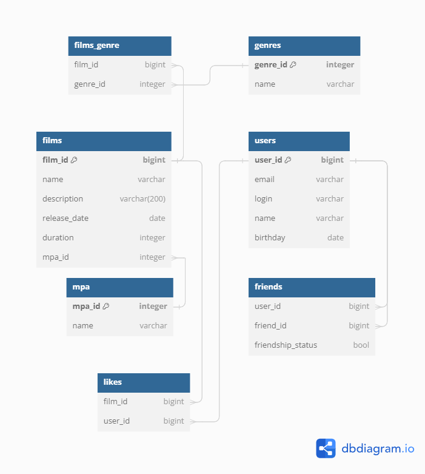

# Filmorate
Filmorate project - Educational project to create a service for rating films.

[Database diagram](https://dbdiagram.io/d/66749d7f5a764b3c7205c21b)

The database contains information about films (table films) and users (table users). 
Each film can have MPA rating (table mpa) and several genres (table genres). 
Each user can like film (table likes) and have friends (table friends). Friendship can be of different status (table friendship_status).


### Database structure


### SQL queries examples

Get films genres

```sql
SELECT 
	f.name,
	g.name
FROM films AS f
LEFT JOIN films_genre AS fg ON fg.film_id = f.film_id
LEFT JOIN genres AS g ON fg.genre_id = g.genre_id;
```

Get 10 most liked films

```sql
SELECT 
	f.name,
	COUNT(l.film_id)
FROM films AS f
LEFT JOIN likes AS l ON l.film_id = f.film_id
GROUP BY name
ORDER BY COUNT(l.film_id) DESC
limit(10);
```

Get number of each user friends

```sql
SELECT 
	u.name,
	COUNT(f.friend_id)
FROM users AS u
LEFT JOIN friends AS f ON f.user_id = u.user_id
GROUP BY name
ORDER BY COUNT(f.friend_id) DESC;
```


